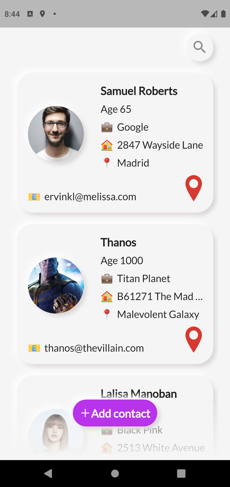
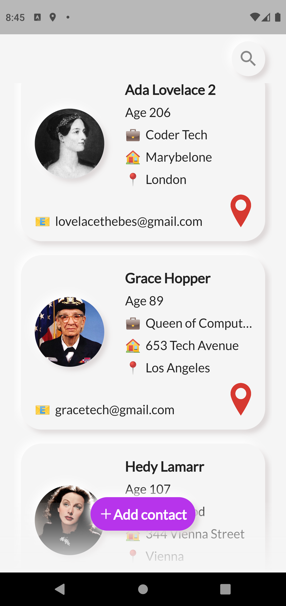
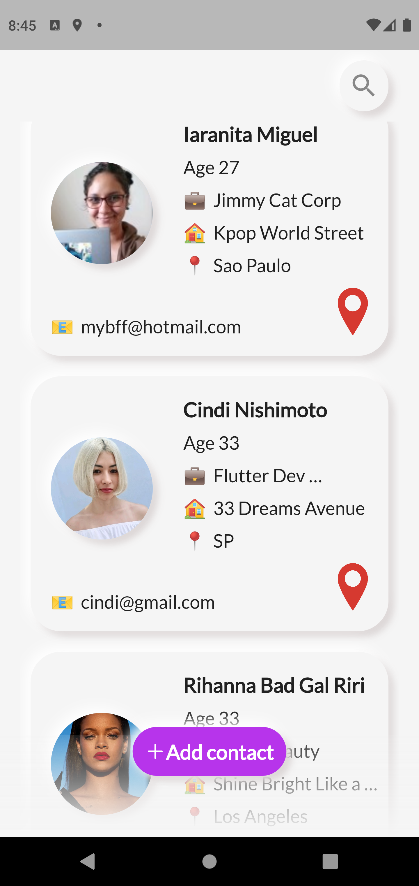
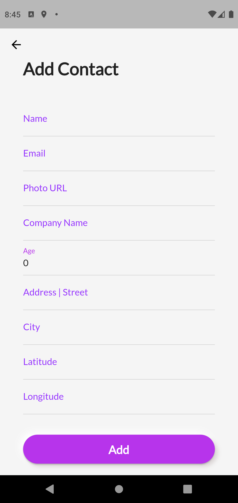
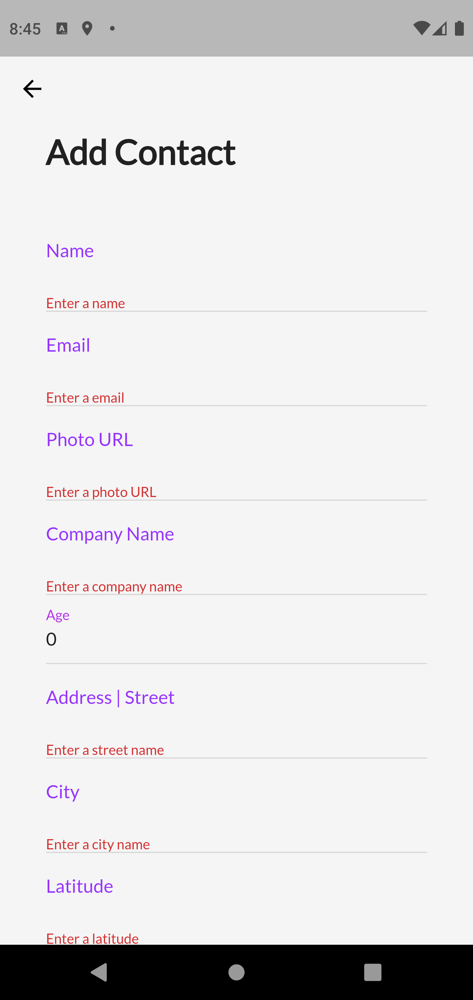
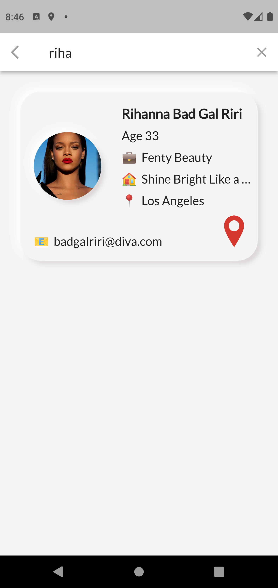
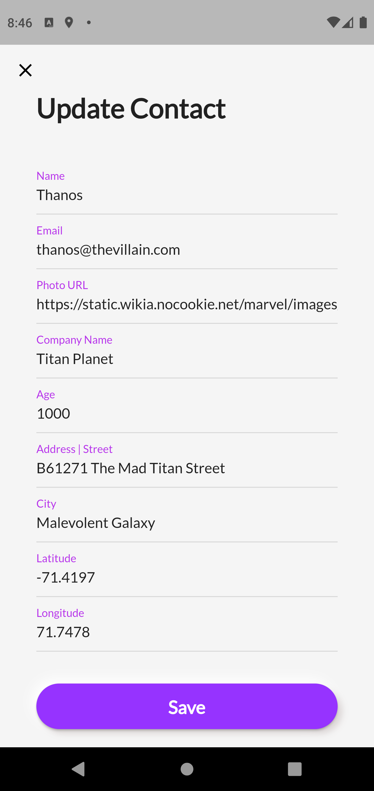
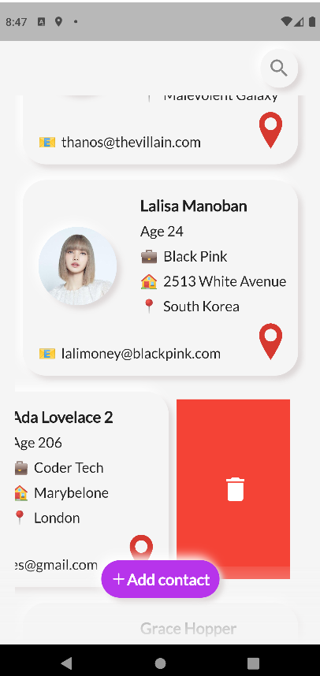

# Contacts List App (from API)
This project shows how to implement a contacts list app with CRUD.

  
   
  
  
  
  
  
  

A Contacts List App getting data from / to API 
applying 4 http methods: get, post, put and delete.

